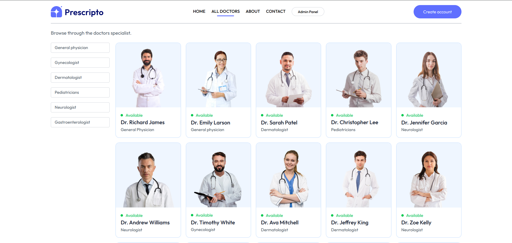
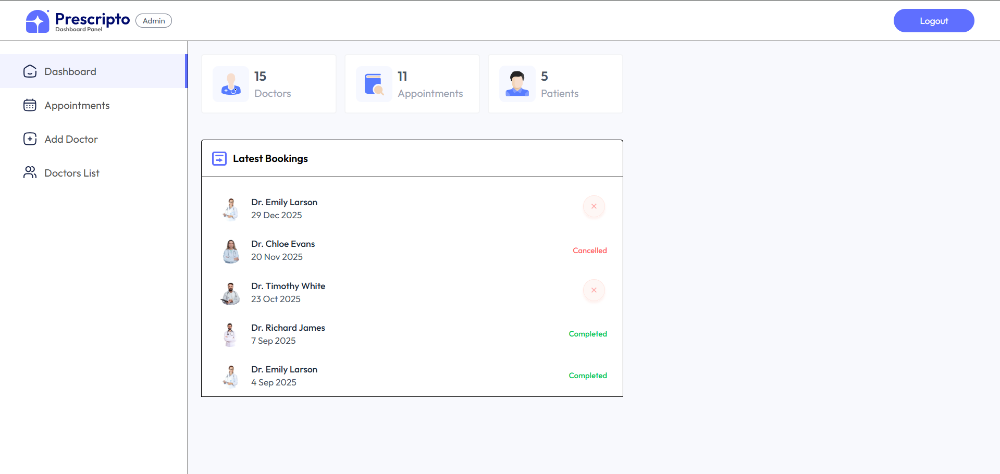
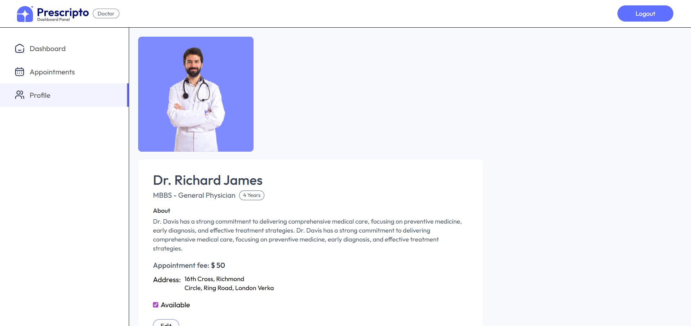

<p align="center">
  
</p>

<p align="center">
  
  
  
  
  
</p>
<p align="center">
  
  
  
  
  
</p>


# 🏥 Prescripto – Doctor Appointment Booking Platform

**Prescripto** is a full-stack healthcare management platform built to simplify doctor discovery, appointment booking, and prescription workflows using a secure role-based system.

- **Client (Patient App):**  
  👉 https://prescripto-fphf.vercel.app  

- **Admin / Server Dashboard:**  
  👉 https://prescripto-wvls.vercel.app  

This repository contains the frontend and backend logic powering the Prescripto platform.

---

## 📌 Overview

Prescripto addresses real healthcare workflow problems by providing a structured system for managing patients, doctors, appointments, and payments.

The platform enables:
- Patients to browse doctors and book appointments
- Admins to manage doctors, users, and appointments
- Secure JWT-based authentication
- Razorpay payment integration
- Cloud-based image storage

This project follows production-style architecture and security practices.

---

## 🧱 Architecture

- **Frontend:** React (Vite)
- **Admin Panel:** React (Vite)
- **Backend:** Node.js + Express
- **Database:** MongoDB
- **Authentication:** JWT
- **Payments:** Razorpay
- **Deployment:** Vercel

Frontend, admin, and backend are logically separated for scalability and maintainability.

---

## ⚙️ Tech Stack

### Frontend / Admin
- React.js
- Vite
- React Router DOM
- Axios
- Tailwind CSS v4
- Swiper.js

### Backend
- Node.js
- Express.js
- MongoDB
- JWT (JSON Web Tokens)
- Cloudinary
- Razorpay

### Tooling & Deployment
- VS Code
- Vercel

---

## 🔐 Authentication & Roles

Prescripto uses JWT-based authentication with strict role-based access control.

### Roles
- **Patient**
  - Register and login
  - Browse doctors
  - Book appointments
  - Make payments

- **Admin**
  - Manage doctors and users
  - View and control appointments
  - Monitor platform activity

All protected routes are secured at the API level.

---

## 🚀 Key Features

- Doctor discovery with profile images and specialties
- Appointment booking with payment integration
- Admin dashboard with full CRUD operations
- Cloudinary-based media storage
- JWT-protected REST APIs
- Razorpay payment gateway
- Fully responsive UI

---

## 🔗 Live Applications

- **Client App:**  
  https://prescripto-fphf.vercel.app  

- **Admin / Server Interface:**  
  https://prescripto-wvls.vercel.app  

---

## 🧪 Local Development

### Prerequisites
- Node.js (v18+ recommended)
- MongoDB (local or cloud)
- npm or yarn

---

**Installation**

Install the project dependencies using npm:

```bash
npm install
```

**Set Up Environment Variables for Frontend**

Create a new file named `.env` in the root of your project and add the following content:

```env
VITE_BACKEND_URL=http://localhost:4000
```

**Set Up Environment Variables for Admin**

Create a new file named `.env` in the root of your project and add the following content:

```env
VITE_BACKEND_URL=http://localhost:4000
```

**Set Up Environment Variables for Backend**

Create a new file named `.env` in the root of your project and add the following content:

```env
MONGODB_URI=your_mongodb_connection_string

CLOUDINARY_NAME=your_cloudinary_name
CLOUDINARY_API_KEY=your_cloudinary_api_key
CLOUDINARY_SECRET_KEY=your_cloudinary_secret_key

ADMIN_EMAIL=admin@example.com
ADMIN_PASSWORD=strong_admin_password

JWT_SECRET=prescripto

RAZORPAY_KEY_ID=your_razorpay_key_id
RAZORPAY_KEY_SECRET=your_razorpay_key_secret

CURRENCY=INR
```

📸 Application Screenshots

Below are key UI screens from the Prescripto platform, covering patient, admin, and doctor workflows.

<p align="center">
  
</p>
<p align="center">
  <em>Landing page allowing patients to browse doctors and book appointments easily.</em>
</p>

<p align="center">
  
</p>
<p align="center">
  <em>Doctor listing with specialization-based filtering and real-time availability.</em>
</p>

<p align="center">
  
</p>
<p align="center">
  <em>Admin dashboard showing total doctors, patients, appointments, and recent activity.</em>
</p>

<p align="center">
  
</p>
<p align="center">
  <em>Doctor profile page displaying qualifications, experience, availability, and fees.</em>
</p>

